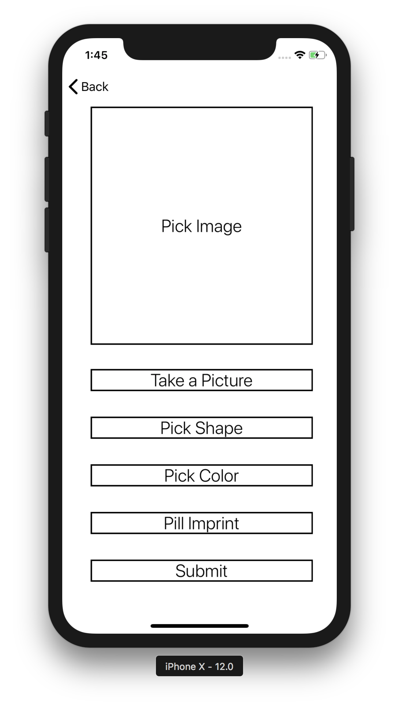

Pill Identifier
-
An ios mobile app for identifying and researching
prescription medications

***Developed by Eric Phung.***

#### NLM RxImages
- [NLM RxIMAGE API](https://lhncbc.nlm.nih.gov/rximage-api)

- [RzImage API Paramaters](https://rxnav.nlm.nih.gov/RxImageAPIParameters.html)

#### View Layouts

<!--

-->

#### Background Images

#### CocoaPod Libraries
pod 'SwiftyJSON', '~> 4.0'  
pod 'ActionSheetPicker-3.0'  
pod 'Alamofire', '~> 4.7'  
pod 'Kingfisher', '~> 4.0'  

