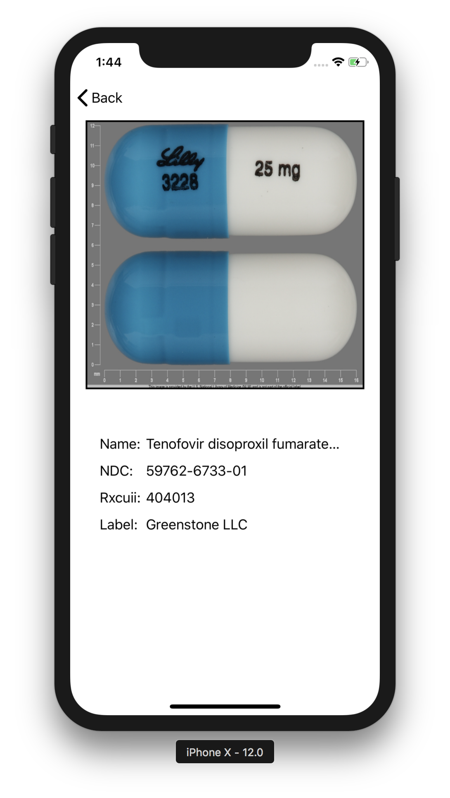

<h1>Pill Identifier</h1>

An ios mobile app for identifying and researching
prescription medications

***Developed by Eric Phung.***

<h4>NLM RxImages</h4>

- [NLM RxIMAGE API](https://lhncbc.nlm.nih.gov/rximage-api)

- [RzImage API Paramaters](https://rxnav.nlm.nih.gov/RxImageAPIParameters.html)

<h4>Basic Views</h4>

 

<h4>Background Images</h4>

<h4>CocoaPod Libraries</h4>
pod 'SwiftyJSON', '~> 4.0'  
pod 'ActionSheetPicker-3.0'  
pod 'Alamofire', '~> 4.7'  
pod 'Kingfisher', '~> 4.0'  

