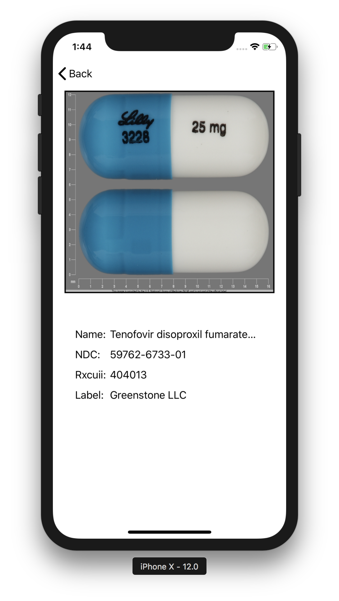
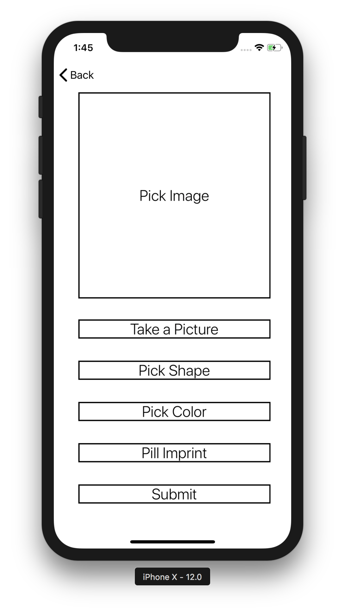

# Pill Identifier

An ios mobile app for identifying and researching
prescription medications

*Developed by Eric Phung*

#### Run Instructions
>Open up ***Pill Identifier App.xcworkspace*** file <br>
Run the simulator on an iphone device in Xcode


#### Resource Links
- [NLM RxIMAGE API](https://lhncbc.nlm.nih.gov/rximage-api)

- [RzImage API Paramaters](https://rxnav.nlm.nih.gov/RxImageAPIParameters.html)

<!--
#### View Layouts


-->
<!--


-->

##### Background Images


#### CocoaPod Libraries

```language
pod 'SwiftyJSON', '~> 4.0'
pod 'ActionSheetPicker-3.0'
pod 'Alamofire', '~> 4.7'
pod 'Kingfisher', '~> 4.0'
```

***Copyright Eric Phung 2018***